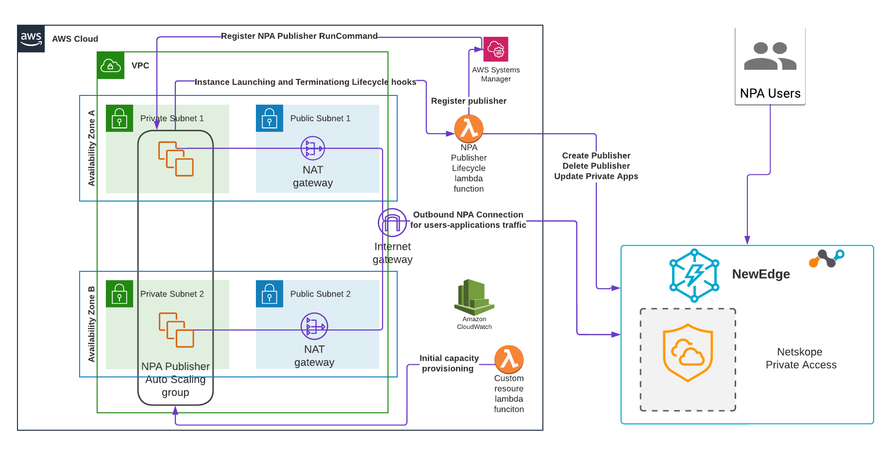

Deploying Netskope Private Access Publisher with Amazon EC2 Auto Scaling

This document will guide you how to deploy Netskope Private Access Amazon EC2 Auto Scaling.

Netskope Private Access (NPA), a Zero Trust Network Access (ZTNA) solution, seamlessly connects authenticated users anywhere, using any devices to private resources in data centers and public cloud environments. Built on the NewEdge security private cloud, NPA delivers fast and direct application connectivity, ensuring a superior user experience.

To learn more about Netskope Private Access please refer to the [Netskope Private Access](https://www.netskope.com/products/private-access) product overview  and [Netskope Private Access](https://docs.netskope.com/en/netskope-private-access.html) documentation. 

Amazon EC2 Auto Scaling helps you maintain application availability and allows you to automatically add or remove EC2 instances according to conditions you define. You can use the fleet management features of EC2 Auto Scaling to maintain the health and availability of your fleet. You can also use the dynamic and predictive scaling features of EC2 Auto Scaling to add or remove EC2 instances. Dynamic scaling responds to changing demand and predictive scaling automatically schedules the right number of EC2 instances based on predicted demand. Dynamic scaling and predictive scaling can be used together to scale faster. To learn more about Amazon EC2 Auto Scaling please refer to the [Amazon EC2 Auto Scaling](https://aws.amazon.com/ec2/autoscaling/) documentation. 

Deploying Netskope Private Publisher using Amazon EC2 Auto Scaling group allows you to dynamically respond to the users’ traffic demand and to optimize cost of running your Netskope Private Access Publishers’ EC2 instances. 

*Overview*

The solution consists of AWS CloudFormation template NPAPublisherAuto Scalling.yaml which deploys the following main resources:

- Amazon EC2 Auto Scaling group of Netskope Private Publishers in your VPC. This Auto Scaling group has CPU-based Amazon EC2 [Dynamic Scaling Policy](https://docs.aws.amazon.com/autoscaling/ec2/userguide/as-scale-based-on-demand.html) with default CPU utilization target  75% which you can change during the deployment

- AWS Lambda function triggered automatically when new NPA Publisher EC2 instances are added or removed from the EC2 Auto Scaling group. This Lambda function calls [Netskope REST API v2](https://docs.netskope.com/en/rest-api-v2-overview-312207.html)  to provision and deprovision NPA Publisher in your Netskope tenant. It also identifies the [Netskope Private Applications](https://docs.netskope.com/en/private-app-management.html) that are using your Netskope Publisher EC2 Auto Scaling group and updates their configuration accordingly by removing or adding the specific publisher. The Netskope Private Applications naming convention required for this solution to function properly described in the next paragraph below

- Amazon EC2 Auto Scaling NPA Publisher Launching and Terminating Lifecycle Hooks to invoke the above Lambda function

- AWS Secrets Manager secret to store  Netskope REST API v2 access token. You can reuse the same AWS Secrets Manager Secret for multiple NPA Publisher Autos Scaling groups, providing the existing AWS Secrets Manager Secret ARN during the deployment, or choose to create a new AWS Secrets Manager Secret while deploying the solution. When choosing to use the existing Secret assure its resource-based policy allows *secretsmanager:GetSecretValue* and  *secretsmanager:DescribeSecret* actions to the NPACallNetskopeAPIv2LFRole Lambda Function IAM role created by this solution. For more details about AWS Secrets Manager security please refer to the user guide [here](https://docs.aws.amazon.com/secretsmanager/latest/userguide/auth-and-access.html)

- Custom resource AWS Lambda function to update your NPA Publisher Autoscaling group initial capacity during creation

- AWS IAM roles for the EC2 Instances in the Auto Scaling group. This role contains AWS-managed IAM policy AmazonSSMManagedInstanceCore to allow EC2 instance management by the AWS Systems Manager. This is required to provision and deprovision NPA Publisher on your Netskope tenant. For more information about setting Amazon Systems Manager on your account please follow this [link](https://docs.aws.amazon.com/systems-manager/latest/userguide/session-manager-working-with-sessions-start.html).

- AWS IAM roles for the NPA Publisher EC2 instances lifecycle management AWS Lambda function and for the custom resource AWS Lambda.

- NetskopeCETaskSecurityGroup will be used by the Netskope CE task

The solution also creates a NetskopeNPACustomResourceLF custom resource AWS Lambda function which is used to update your NPA Publisher Autoscaling group initial capacity. 

This solution is a regional solution and can / may be deployed independently in multiple AWS regions. You can build a cross-region redundant NPA Publisher group following the same naming convention below.

*Naming convention*

This solution requires a specific naming convention between the Netskope Private Access Publisher EC2 Auto Scaling group and the Netskope Private Applications using this Publishers’ group. 

For the solution to function properly, Netskope Private Applications names shall start from the name of the Netskope Private Access Publisher EC2 Auto Scaling group. For example, if you’re deploying an NPA Publisher EC2 Auto Scaling group with this solution, named MyNPAPublisherGroup1, the Netskope Private Applications names using this Publishers group should be MyNPAPublisherGroup1-MyApp1, MyNPAPublisherGroup1-MyApp2,..

This will allow the provisioning Lambda function to identify the applications using the specific NPA Publisher group and to update their configuration automatically. You can deploy a  Netskope Private Access Publisher EC2 Auto Scaling group with the same name in more than one AWS region. Both deployments will be serving the same Netskope Private Applications on your Netskope tenant, which essentially allows you to build a cross-region redundant ZTNA solution. 

*Architecture diagram*

*Fig 1. Netskope Private Access Publisher with Amazon EC2 Auto Scaling*

*Prerequisites* 

The following prerequisites are required to implement the Netskope Private Access Publisher Auto Scaling:  

- Existing Amazon VPC with minimum of two subnets in different Availability Zones and outbound connectivity to the Netskope NewEdge platform, as well as with regional endpoint for Amazon S3 for the Custom Resource AWS Lambda function to report its status to Amazon CloudFormations. 

Note that this solution deploys Netskope Private Access Publisher EC2 Instances without assigning public IP addresses. 

For the best security, to enable Netskope Private Access Publisher communication with the Netskope NewEdge platform we recommend deploying [Amazon Nat Gateway](https://docs.aws.amazon.com/vpc/latest/userguide/vpc-nat-gateway.html) in your VPC. Alternatively, you can use  IPsec integration between your AWS environment and Netskope NewEdge described [here](https://docs.netskope.com/en/netskope-ipsec-with-amazon-web-services.html).

- AWS Systems Manager [enabled and configured](https://docs.aws.amazon.com/systems-manager/latest/userguide/systems-manager-setting-up-ec2.html) to manage your EC2 Instances. 
- This solution guide assumes working knowledge with the AWS management console and AWS CLI. We also recommend that you become familiar with the following AWS services:
- [AWS Lambda](https://aws.amazon.com/lambda/)
- [Amazon CloudWatch](https://aws.amazon.com/cloudwatch/)
- [AWS CloudFormation](https://docs.aws.amazon.com/AWSCloudFormation/latest/UserGuide/GettingStarted.html)
- [Amazon VPC](https://aws.amazon.com/vpc/)
- [AWS Systems Manager](https://docs.aws.amazon.com/systems-manager/latest/userguide/what-is-systems-manager.html)
- [Amazon EC2](https://aws.amazon.com/pm/ec2/?trk=36c6da98-7b20-48fa-8225-4784bced9843&sc_channel=ps&sc_campaign=acquisition&sc_medium=ACQ-P%7CPS-GO%7CBrand%7CDesktop%7CSU%7CCompute%7CEC2%7CUS%7CEN%7CText&s_kwcid=AL!4422!3!467723097970!e!!g!!amazon%20ec2&ef_id=CjwKCAjwgr6TBhAGEiwA3aVuIWRtlURhnipk78tgMhYoPLPkVCyYTL7UojiCM6EO30gIvDVPRY1MCRoCMKUQAvD_BwE:G:s&s_kwcid=AL!4422!3!467723097970!e!!g!!amazon%20ec2)
- [Amazon EC2 Auto Scaling](https://aws.amazon.com/ec2/autoscaling/)
- [AWS IAM](https://aws.amazon.com/iam/)

*Deployment and Configuration Steps*

## Deploying Netskope Private Access EC2 Auto Scaling group.
Download the [NPAPublisherAutoscalling.yaml](https://github.com/netskopeoss/AWS-NPA-Publisher-AutoScaling/blob/main/NPAPublisherAutoscalling.yaml) to your computer.

**Step 1.1:** **Identifying Amazon Machine Images (AMI) ID for the Netskope Publisher EC2 image on Amazon Marketplace.**

Prior to deploying the NPA Publisher Auto Scaling group you need to identify the Amazon Machine Images (AMI) ID for the Netskope Publisher EC2 image. 

1.1.1. To find out the latest Netskope Publisher EC2 image AMI ID for your region, Sign into the EC2 Security Management account as administrator and change the AWS Region to the region where you’ll be deploying the NPA Publisher Auto Scaling group. 

1.1.2. Go to AMI Catalog, AWS Marketplace AMIs and type Netskope in the search bar. Click Select on the Netskope Private Access Publisher.

1.1.3. Click Continue:

1.1.4. Click Launch Instance with AMI:

1.1.5. Copy the AMI ID (ami-xxxxxxxxx) and save it for later.

You can create your custom EC2 image from the one provided by Netskope, hardening it according to your organization's security standards, following the documentation [here](https://docs.aws.amazon.com/AWSEC2/latest/UserGuide/creating-an-ami-ebs.html). Then you can use this custom AMI for your deployment.

**Step 1.2:** **Deploy the CloudFormation Stack on the AWS Security Management account**

Sign into the AWS Security Management account as administrator and deploy the Netskope Cloud Exchange CloudFormations stack. 

1.2.1.  Navigate to the AWS CloudFormation management console and choose the region you’d like to deploy the automation solutions in the Security Management account. 
1.2.2. Click **Create Stack** and choose **With new resources (standard)**.

1.2.3. Choose **Upload a template file** then click on Choose file. Choose the NPAPublisherAutoscalling.yaml from the directory on your disk where you downloaded it to, click **Open** and then click **Next**.

1.2.4. Enter the stack name and the parameters for your deployment:

|
Netskope tenant FQDN, for example mytenant.goskope.com

|Enter your Netskope tenan FQDN here (mytenant.goskope.com)|
| :- | :- |
|Choose if you'd like to create a new AWS Secrets Manager key for Netskope API token or to use the existing one|Choose Yes or No to provision new Netskope API v2 token in AWS Secrets Manager|
|
If you're using the existing AWS Secrets Manager secret for Netskope API token enter its ARN here. Assure this secret resource-based policy allows the Lambda function created by this template to use this secret

|If an existing Netskope API v2 token in AWS Secrets Manager will be used, enter the secret ARN here. The Secrets Manager secret for Netskope API should be provisioned in the same region|
|Netskope API v2 token if you're creating a new secret in AWS Secrets Manager|If new Netskope API v2 token has to be provisioned in AWS Secrets Manager, enter it here. Follow the documentation [here](https://docs.netskope.com/en/rest-api-v2-overview-312207.html) to learn how to obtain Netskope REST API v2 access token. |
|
VPC id where you'd like your NPA publisher auto scaling group to be deployed

|
NPA publisher VPC Id

|
|List of VPC subnets where you'd like your NPA publisher auto scaling group to be deployed|NPA publisher Availability Zones|
|NPA Publisher Auto Scaling Group Name|The new NPA publisher auto scaling group name. All private applications names served by this publisher group should start from this value|
|NPA publisher AMI id|The AMI ID you retrieved in the step 1.1 or your custom AMI ID|
|
Access key for the new EC2 instances in the autoscaling group

|
NPA publisher KeyPair Name

|
|NPA publisher minimum capacity|
NPA publisher minimum capacity

|
|
NPA publisher maximum capacity

|NPA publisher maximum capacity|
|
NPA publisher desired capacity

|
NPA publisher Desired capacity

|
|
CPU %% value to trigger auto scaling

|NPA publisher target CPU %%|

1.2.5. Click **Next**.
1.2.6. Optionally, enter the Tags for your CloudFormation stack and / or click Next.

1.2.7. Acknowledge creating IAM resources and click **Create stack**.

*Monitoring*

1.2.8. When CloudFormation stack is in the CREATE\_COMPLETE state, navigate to the Resources tab and see the resources provisioned by the CloudFormation stack.

1.2.9. Click on the NPAPublisherSecurityGroup resource and check the Inbound and Outbound rules for the EC2 Auto Scaling Instances:

Note that NPA Publisher instances don't require any inbound rules. If you’d like to sign in into a specific Publisher instance, use [AWS Systems Manager](https://docs.aws.amazon.com/systems-manager/latest/userguide/session-manager-working-with-sessions-start.html) to connect to the Publisher instance. 

You can further harden the outbound rules by limiting outbound access  only to the Netskope IP address ranges, your DNS service and the Private Applications this specific Publisher Group is serving. 

1.2.10. Review the Auto Scaling group configuration and status. Go to the Amazon EC2 Management console, Auto Scaling Groups, choose your Netskope Publisher Auto Scaling group and to Instance management tab:

` `

1.2.11. To monitor the NPA Lifecycle management AWS Lambda function, navigate to the CloudFormation stack Resources tab:

1.2.12. Click on the NetskopeNPACustomResourceLF, then in the AWS Lambda management console go to Monitor and click on the View logs in CloudWatch:

1.2.13. Choose the latest CloudWatch stream:

1.2.14. The latest Netskope Lifecycle AWS Lambda function logs will appear:

1.2.15. To monitor AWS Systems Manager Run Command status, go to the AWS Systems Manager console, Run Command, Command history and check the status of the Registering NPA Publisher command

Now your Netskope Private Access Publisher EC2 Autoscaling group will be automatically provisioning and de-provisioning Publisher EC2 instances based on the CPU usage.  

For complete documentation on how to use Netskope Cloud Exchange please refer to the [Netskope Public Access documentation](https://docs.netskope.com/en/netskope-private-access.html). 

